# Real-Time Price Analysis System - Architecture Design

## Overview

This document outlines the architecture for a real-time streaming system that analyzes price data at 15-minute intervals. The system runs **parallel** to the existing Phase 9 daily batch processing, adding live intraday detection capabilities.

## Architecture Diagram

```mermaid
graph TB
    subgraph Data Sources
        WS[WebSocket Stream<br/>15m OHLCV]
        API[REST API<br/>Historical Data]
    end
    
    subgraph Streaming Pipeline
        WS --> DQ[Data Queue<br/>Kafka/Redis Stream]
        DQ --> IV[Incremental<br/>Validator]
        IV --> IFC[Incremental<br/>Feature Calculator]
    end
    
    subgraph Pattern Engine
        IFC --> TPM[Tolerance-Based<br/>Pattern Matcher]
        TPM --> MRD[Market Regime<br/>Detector]
        MRD --> PE[Probability<br/>Estimator]
    end
    
    subgraph Outputs
        PE --> RDA[Real-Time<br/>Dashboard API]
        PE --> ALRT[Alert System<br/>WebSocket/Push]
        PE --> LOG[Event Log]
    end
    
    subgraph Existing System
        P9[Phase 9<br/>Daily Batch]
        P3[Phase 3<br/>Feature Engineering]
        FP[Final Portfolio<br/>20 Patterns]
    end
    
    FP --> TPM
    API --> P3
    P3 --> P9
    
    style WS fill:#4ecca3
    style IFC fill:#ffd700
    style TPM fill:#e94560
    style PE fill:#16213e
```



## System Components

### 1. WebSocket Data Streamer (`src/streaming_data_streamer.py`)

**Purpose:** Establishes real-time connection to fetch 15-minute OHLCV bars

**Responsibilities:**
- Connect to WebSocket API (Alpaca/Yahoo Finance)
- Handle connection recovery and reconnection
- Validate incoming data against historical baseline (98% confidence threshold)
- Buffer data for feature calculation
- Emit events: `new_bar`, `connection_status`, `error`

**Configuration:**
```yaml
streaming:
  provider: "alpaca"  # or "yahoo"
  ticker: "XOM"
  interval: "15m"
  validation:
    confidence_threshold: 98
    max_price_deviation_pct: 5
    max_volume_deviation_pct: 10
  buffer_size: 252  # One year of 15m bars
```

**Key Methods:**
```python
class WebSocketStreamer:
    async def connect(self)
    async def disconnect(self)
    async def on_message(self, message)
    def validate_bar(self, bar, historical_baseline)
    def emit(self, event_type, data)
```

---

### 2. Incremental Feature Calculator (`src/incremental_feature_calculator.py`)

**Purpose:** Updates technical indicators incrementally without recalculating entire history

**Design Principles:**
- Maintain rolling window state (last N values for each indicator)
- Use incremental formulas where possible (EMA, rolling sums)
- Cache expensive calculations
- Only recalculate when new bar arrives

**Feature Categories & Incremental Updates:**

| Feature | Current Method | Incremental Method |
|---------|---------------|---------------------|
| SMA | `rolling(n).mean()` | `prev_sma + (new_val - old_val) / n` |
| EMA | `ewm(span=n)` | `prev_ema + alpha * (new_val - prev_ema)` |
| RSI | Full window recalc | Maintain gains/losses rolling sum |
| MACD | Full recalc | Update EMAs incrementally |
| ATR | `rolling(n).mean()` | Maintain TR rolling sum |
| Volume MA | `rolling(n).mean()` | `prev_vol_ma + (new_vol - old_vol) / n` |

**State Management:**
```python
class IncrementalFeatureCalculator:
    def __init__(self, config):
        self.state = {
            # Rolling windows
            'price_history': deque(maxlen=252),
            'volume_history': deque(maxlen=252),
            
            # EMA states
            'ema_12': None,
            'ema_26': None,
            'ema_50': None,
            'ema_200': None,
            
            # RSI states
            'rsi_gains_14': deque(maxlen=14),
            'rsi_losses_14': deque(maxlen=14),
            
            # ATR states
            'tr_history': deque(maxlen=14),
            
            # MACD states
            'macd_line': None,
            'macd_signal': None,
            
            # Volume states
            'vol_ma_20': None,
            'obv': 0,
        }
    
    def update(self, new_bar: dict) -> dict:
        """Return updated features for the new bar"""
        # Update all features incrementally
        # Return feature dict matching Phase 3 format
```

**Feature Output Format:**
```python
{
    'timestamp': '2026-01-30T08:15:00Z',
    'Open': 105.50,
    'High': 106.20,
    'Low': 105.30,
    'Close': 106.00,
    'Volume': 1500000,
    'RSI_14': 65.4,
    'MACD_Histogram': 0.12,
    'ATR_14_Pct': 1.8,
    'Vol_Ratio_20': 1.2,
    'Dist_MA_50': 2.3,
    'Trend_Regime': 'Strong Bull',
    'Vol_Regime': 'Medium',
    # ... all 152 features
}
```

---

### 3. Tolerance-Based Pattern Matcher (`src/tolerance_pattern_matcher.py`)

**Purpose:** Matches patterns with ±5% tolerance bands for real-time conditions

**Why Tolerance-Based:**
- Exact thresholds are brittle with intraday volatility
- 15-minute bars have more noise than daily bars
- Allows partial matches with confidence scoring

**Matching Algorithm:**

```python
class TolerancePatternMatcher:
    def __init__(self, tolerance_pct=5.0):
        self.tolerance_pct = tolerance_pct
    
    def match_pattern(self, pattern: dict, features: dict) -> dict:
        """
        Returns match result with confidence score 0-100%
        
        Scoring:
        - Each condition: 0-100 points based on proximity to threshold
        - Overall: Average of all condition scores
        - Bonus: All conditions met within tolerance = +10%
        """
        conditions = pattern['conditions']
        total_score = 0
        condition_details = {}
        
        for feature, condition in conditions.items():
            required_value = condition['value']
            operator = condition['operator']
            current_value = features.get(feature)
            
            if current_value is None:
                condition_details[feature] = {
                    'score': 0,
                    'met': False,
                    'current': None,
                    'required': required_value,
                    'distance_pct': None
                }
                continue
            
            # Calculate tolerance band
            tolerance_band = abs(required_value) * (self.tolerance_pct / 100)
            lower_bound = required_value - tolerance_band
            upper_bound = required_value + tolerance_band
            
            # Determine if condition is met
            is_met = self._check_operator(current_value, required_value, operator)
            
            # Calculate score based on proximity
            if is_met:
                # Exact match = 100, at tolerance boundary = 70
                distance = abs(current_value - required_value)
                if distance == 0:
                    score = 100
                else:
                    score = 100 - (distance / tolerance_band) * 30
            else:
                # Outside tolerance = 0
                score = 0
            
            condition_details[feature] = {
                'score': min(100, max(0, score)),
                'met': is_met,
                'current': current_value,
                'required': required_value,
                'distance_pct': (distance / abs(required_value)) * 100 if required_value != 0 else 0
            }
            
            total_score += score
        
        # Calculate overall confidence
        avg_score = total_score / len(conditions) if conditions else 0
        
        # Bonus for all conditions met within tolerance
        all_within_tolerance = all(
            d['met'] or d['distance_pct'] <= self.tolerance_pct
            for d in condition_details.values()
        )
        if all_within_tolerance:
            avg_score = min(100, avg_score + 10)
        
        return {
            'pattern_id': pattern.get('id'),
            'confidence_score': avg_score,
            'conditions_met': sum(1 for d in condition_details.values() if d['met']),
            'total_conditions': len(conditions),
            'condition_details': condition_details,
            'status': self._get_status(avg_score)
        }
    
    def _check_operator(self, current, required, operator):
        if operator == '>=':
            return current >= required
        elif operator == '<=':
            return current <= required
        elif operator == '>':
            return current > required
        elif operator == '<':
            return current < required
        return False
    
    def _get_status(self, confidence):
        if confidence >= 90:
            return 'TRIGGERED'
        elif confidence >= 70:
            return 'NEAR_TRIGGER'
        elif confidence >= 50:
            return 'WATCHING'
        return 'NOT_TRIGGERED'
```

**Status Thresholds:**
| Confidence | Status | Action |
|------------|--------|--------|
| 90-100% | TRIGGERED | Alert user, high confidence trade signal |
| 70-89% | NEAR_TRIGGER | Monitor closely, prepare for entry |
| 50-69% | WATCHING | Track pattern development |
| <50% | NOT_TRIGGERED | Ignore |

---

### 4. Market Regime Detector (`src/market_regime_detector.py`)

**Purpose:** Detect real-time market regimes and adjust pattern weights dynamically

**Regime Detection:**

```python
class MarketRegimeDetector:
    def __init__(self, config):
        self.window_size = 20  # 20 bars = 5 hours for 15m
        self.volatility_thresholds = {
            'low': 1.5,      # ATR% < 1.5%
            'medium': 3.0,    # 1.5% <= ATR% < 3.0%
            'high': None      # ATR% >= 3.0%
        }
        self.trend_thresholds = {
            'strong_up': 0.2,     # MA slope > 0.2%
            'weak_up': 0.05,      # 0.05% < MA slope <= 0.2%
            'neutral': -0.05,     # -0.05% <= MA slope <= 0.05%
            'weak_down': -0.2,    # -0.2% <= MA slope < -0.05%
            'strong_down': None   # MA slope < -0.2%
        }
    
    def detect(self, features_history: list) -> dict:
        """
        Detect current market regime from recent feature history
        
        Returns:
            {
                'volatility_regime': 'low'|'medium'|'high',
                'trend_regime': 'strong_up'|'weak_up'|'neutral'|'weak_down'|'strong_down',
                'volatility_score': 0-100,
                'trend_score': 0-100,
                'atr_pct': float,
                'ma_slope': float,
                'rsi': float,
                'volume_ratio': float
            }
        """
        recent = features_history[-self.window_size:]
        
        # Calculate ATR% average
        atr_values = [f.get('ATR_14_Pct', 0) for f in recent]
        avg_atr = sum(atr_values) / len(atr_values)
        
        # Calculate MA slope
        close_values = [f.get('Close', 0) for f in recent]
        ma_slope = ((close_values[-1] - close_values[0]) / close_values[0]) * 100
        
        # Determine regimes
        vol_regime = self._classify_volatility(avg_atr)
        trend_regime = self._classify_trend(ma_slope)
        
        # Calculate scores (0-100)
        vol_score = min(100, (avg_atr / 5.0) * 100)  # Normalize to 0-100
        trend_score = self._normalize_trend(ma_slope)
        
        return {
            'volatility_regime': vol_regime,
            'trend_regime': trend_regime,
            'volatility_score': vol_score,
            'trend_score': trend_score,
            'atr_pct': avg_atr,
            'ma_slope': ma_slope,
            'rsi': recent[-1].get('RSI_14', 50),
            'volume_ratio': recent[-1].get('Vol_Ratio_20', 1.0)
        }
    
    def get_regime_adjustment(self, pattern: dict, current_regime: dict) -> float:
        """
        Calculate pattern weight adjustment based on regime compatibility
        
        Returns adjustment factor (0.5 to 1.5):
        - 1.0 = neutral
        - >1.0 = pattern performs better in current regime
        - <1.0 = pattern performs worse in current regime
        """
        pattern_vol_regime = pattern.get('volatility_regime', 'All')
        pattern_trend_regime = pattern.get('trend_regime', 'All')
        
        current_vol = current_regime['volatility_regime']
        current_trend = current_regime['trend_regime']
        
        adjustment = 1.0
        
        # Volatility regime adjustment
        if pattern_vol_regime != 'All':
            if pattern_vol_regime == current_vol:
                adjustment *= 1.2  # +20% boost
            elif pattern_vol_regime == 'Low' and current_vol == 'High':
                adjustment *= 0.5  # -50% penalty
            elif pattern_vol_regime == 'High' and current_vol == 'Low':
                adjustment *= 0.7  # -30% penalty
        
        # Trend regime adjustment
        if pattern_trend_regime != 'All':
            if 'Bull' in pattern_trend_regime and 'up' in current_trend:
                adjustment *= 1.15
            elif 'Bear' in pattern_trend_regime and 'down' in current_trend:
                adjustment *= 1.15
            elif 'Bull' in pattern_trend_regime and 'down' in current_trend:
                adjustment *= 0.6
            elif 'Bear' in pattern_trend_regime and 'up' in current_trend:
                adjustment *= 0.6
        
        return max(0.5, min(1.5, adjustment))
```

**Regime-Weighted Pattern Selection:**
```
Pattern Score = Base Confidence × Regime Adjustment × Validation Success Rate
```

---

### 5. Probability Estimator (`src/probability_estimator.py`)

**Purpose:** Synthesize historical data with current regime to output probability distributions

**Inputs:**
- Historical success rate from `final_portfolio.json`
- Average move % and timeframe
- Current volatility/regime adjustment
- Pattern confidence score

**Output:**
```python
{
    'pattern_id': 0,
    'pattern_name': 'Pattern 0: Label_2.0pct_10d',
    'base_success_rate': 89.29,  # From portfolio
    'regime_adjusted_rate': 85.5,  # Adjusted for current regime
    'confidence_adjusted_rate': 92.1,  # Adjusted for match confidence
    'final_probability': 87.5,  # Weighted average
    
    'price_targets': {
        'target_1': {
            'move_pct': 2.0,
            'probability': 87.5,
            'expected_time_hours': 16.7,  # 10 days / 24 * 4 (15m bars)
            'time_range_hours': [12, 24]
        },
        'target_2': {
            'move_pct': 3.0,
            'probability': 65.2,
            'expected_time_hours': 25.0,
            'time_range_hours': [20, 36]
        },
        'target_3': {
            'move_pct': 5.0,
            'probability': 42.1,
            'expected_time_hours': 50.0,
            'time_range_hours': [40, 72]
        }
    },
    
    'risk_assessment': {
        'false_positive_probability': 12.5,
        'max_drawdown_pct': 2.5,
        'volatility_risk': 'medium'
    },
    
    'actionable_signals': {
        'entry_signal': 'STRONG BUY',
        'entry_price': 106.00,
        'stop_loss': 103.70,  # -2.5%
        'take_profit_1': 108.12,  # +2.0%
        'take_profit_2': 109.18,  # +3.0%
        'take_profit_3': 111.30,  # +5.0%
        'position_size_pct': 5.0,  # 5% of portfolio
        'time_horizon_hours': 16.7
    }
}
```

**Probability Calculation:**
```python
class ProbabilityEstimator:
    def estimate(self, pattern: dict, match_result: dict, regime: dict) -> dict:
        # 1. Get base metrics from portfolio
        base_rate = pattern['validation_success_rate']
        avg_move = pattern['validation_avg_move']
        avg_time = pattern['validation_avg_time']
        fpr = pattern['validation_false_positive_rate']
        
        # 2. Apply regime adjustment
        regime_adj = self._get_regime_adjustment(pattern, regime)
        regime_adjusted_rate = base_rate * regime_adj
        
        # 3. Apply confidence adjustment
        confidence = match_result['confidence_score']
        confidence_adj = 0.5 + (confidence / 100) * 0.5  # 0.5 to 1.0
        confidence_adjusted_rate = regime_adjusted_rate * confidence_adj
        
        # 4. Calculate final probability (weighted average)
        final_prob = (
            base_rate * 0.4 +
            regime_adjusted_rate * 0.3 +
            confidence_adjusted_rate * 0.3
        )
        
        # 5. Generate price targets
        targets = self._generate_price_targets(
            pattern, final_prob, avg_move, avg_time
        )
        
        # 6. Risk assessment
        risk = self._assess_risk(pattern, regime, final_prob)
        
        # 7. Actionable signals
        signals = self._generate_signals(
            pattern, final_prob, targets, risk
        )
        
        return {
            'pattern_id': pattern.get('id'),
            'base_success_rate': base_rate,
            'regime_adjusted_rate': regime_adjusted_rate,
            'confidence_adjusted_rate': confidence_adjusted_rate,
            'final_probability': final_prob,
            'price_targets': targets,
            'risk_assessment': risk,
            'actionable_signals': signals
        }
```

---

### 6. Real-Time Dashboard API (`src/streaming_dashboard_api.py`)

**Purpose:** WebSocket API for real-time dashboard updates

**Endpoints:**
```javascript
// WebSocket connection
const ws = new WebSocket('ws://localhost:5001/stream');

// Subscribe to pattern updates
ws.send(JSON.stringify({
    action: 'subscribe',
    channels: ['pattern_matches', 'regime_changes', 'alerts']
}));

// Incoming messages
{
    "type": "pattern_match",
    "timestamp": "2026-01-30T08:15:00Z",
    "pattern_id": 0,
    "confidence": 92.5,
    "status": "TRIGGERED",
    "probability": 87.5,
    "actionable_signals": {...}
}

{
    "type": "regime_change",
    "timestamp": "2026-01-30T08:30:00Z",
    "from": {"volatility": "medium", "trend": "neutral"},
    "to": {"volatility": "high", "trend": "weak_bull"}
}

{
    "type": "alert",
    "timestamp": "2026-01-30T08:15:00Z",
    "level": "HIGH",
    "message": "Pattern #0 triggered - STRONG BUY signal",
    "pattern_id": 0,
    "entry_price": 106.00,
    "target_price": 108.12
}
```

---

### 7. Configuration Updates (`config.yaml`)

Add streaming configuration section:

```yaml
# Streaming Configuration (NEW)
streaming:
  enabled: true
  provider: "alpaca"  # Options: alpaca, yahoo, polygon
  
  # Data source settings
  ticker: "XOM"
  interval: "15m"  # 1m, 5m, 15m, 1h, 1d
  buffer_size: 252  # Number of bars to maintain
  
  # WebSocket settings
  ws_url: "wss://stream.alpaca.markets/v2/iex"
  reconnect_interval: 5  # seconds
  max_reconnect_attempts: 10
  
  # Data validation
  validation:
    confidence_threshold: 98  # Match historical baseline
    max_price_deviation_pct: 5
    max_volume_deviation_pct: 10
    require_ohlcv_complete: true
  
  # Pattern matching
  pattern_matching:
    tolerance_pct: 5.0  # ±5% tolerance for conditions
    min_confidence_threshold: 50  # Minimum to show in dashboard
    trigger_threshold: 90  # Minimum to trigger alert
    
  # Market regime detection
  regime_detection:
    window_size: 20  # Number of bars for regime calculation
    volatility_thresholds:
      low: 1.5
      medium: 3.0
    trend_thresholds:
      strong_up: 0.2
      weak_up: 0.05
      neutral: -0.05
      weak_down: -0.2
  
  # Probability estimation
  estimation:
    base_weight: 0.4  # Weight for historical success rate
    regime_weight: 0.3  # Weight for regime adjustment
    confidence_weight: 0.3  # Weight for match confidence
  
  # Alert settings
  alerts:
    enabled: true
    levels:
      HIGH: 90
      MEDIUM: 70
      LOW: 50
    channels:
      - websocket  # Real-time dashboard
      - console    # Log output
      # - email     # Optional: email notifications
      # - telegram  # Optional: Telegram bot
  
  # Dashboard API
  dashboard:
    ws_port: 5001
    http_port: 5002
    update_interval: 1  # seconds (max update frequency)
```

---

## Integration with Existing System

### Parallel Architecture

```
┌─────────────────────────────────────────────────────────────────┐
│                    EXISTING SYSTEM (Daily)                      │
├─────────────────────────────────────────────────────────────────┤
│  Phase 1: Data Acquisition (Daily OHLCV)                        │
│  Phase 2: Movement Labeling                                     │
│  Phase 3: Feature Engineering (152 features)                     │
│  Phase 4: Pattern Discovery                                     │
│  Phase 5: Pattern Optimization                                 │
│  Phase 6: Validation                                            │
│  Phase 7: Portfolio Construction                               │
│  Phase 8: Dashboard Generation                                  │
│  Phase 9: Real-Time Detection (Daily scan)                     │
│  Phase 10: Final Report                                         │
└─────────────────────────────────────────────────────────────────┘
                              │
                              │ Uses final_portfolio.json
                              ▼
┌─────────────────────────────────────────────────────────────────┐
│              NEW STREAMING SYSTEM (15-minute)                    │
├─────────────────────────────────────────────────────────────────┤
│  WebSocket Data Streamer                                        │
│  Incremental Feature Calculator                                 │
│  Tolerance-Based Pattern Matcher                               │
│  Market Regime Detector                                        │
│  Probability Estimator                                         │
│  Real-Time Dashboard API (WebSocket)                            │
│  Alert System                                                  │
└─────────────────────────────────────────────────────────────────┘
```

### Data Flow

1. **Daily Pipeline (Existing)**
   - Runs once per day (after market close)
   - Generates `final_portfolio.json` with 20 patterns
   - Updates historical feature matrix
   - Phase 9 scans latest daily bar

2. **Streaming Pipeline (New)**
   - Runs continuously during market hours
   - Reads `final_portfolio.json` for pattern definitions
   - Fetches 15-minute bars via WebSocket
   - Incrementally updates features
   - Matches patterns with tolerance
   - Detects regime changes
   - Estimates probabilities
   - Pushes updates to dashboard via WebSocket

### Shared Resources

| Resource | Used By | Purpose |
|----------|---------|---------|
| `final_portfolio.json` | Both | Pattern definitions and metrics |
| `data/ohlcv.json` | Daily | Historical OHLCV for validation |
| `data/features_matrix.csv` | Daily | Historical features |
| `reports/latest_alerts.json` | Both | Alert storage |
| `config.yaml` | Both | Configuration |

---

## Implementation Priority

### Phase 1: Core Streaming Infrastructure
1. WebSocket Data Streamer
2. Incremental Feature Calculator
3. Basic pattern matching (exact match)

### Phase 2: Enhanced Pattern Matching
4. Tolerance-based pattern matcher
5. Market regime detector
6. Regime-weighted pattern selection

### Phase 3: Probability & Alerts
7. Probability estimator
8. Alert system
9. Real-time dashboard API

### Phase 4: Integration & Polish
10. Configuration updates
11. Dashboard UI enhancements
12. Error handling and recovery

---

## File Structure

```
src/
├── streaming_data_streamer.py        # NEW
├── incremental_feature_calculator.py # NEW
├── tolerance_pattern_matcher.py      # NEW
├── market_regime_detector.py         # NEW
├── probability_estimator.py          # NEW
├── streaming_dashboard_api.py        # NEW
├── alert_system.py                   # NEW
├── phase9_realtime_detection.py      # EXISTING (keep for daily)
└── phase3_feature_engineering.py     # EXISTING (keep for daily)

config.yaml                            # UPDATE with streaming section

requirements.txt                       # UPDATE with new dependencies
   - websockets
   - aiohttp
   - python-dotenv
```

---

## Dependencies

```txt
# New dependencies for streaming
websockets>=12.0
aiohttp>=3.9.0
python-dotenv>=1.0.0
alpaca-trade-api>=3.0.0  # Optional: for Alpaca streaming
yfinance>=0.2.0           # Alternative: Yahoo Finance

# Existing dependencies (keep)
pandas>=2.0.0
numpy>=1.24.0
pyyaml>=6.0
tqdm>=4.65.0
```

---

## Performance Considerations

### Latency Targets
- WebSocket to feature calculation: <100ms
- Pattern matching: <50ms per pattern (20 patterns = <1s)
- Regime detection: <50ms
- Probability estimation: <50ms
- Total per bar: <2s

### Memory Usage
- Feature state: ~1MB per ticker
- Pattern portfolio: ~100KB
- Data buffer (252 bars): ~50KB
- Total per ticker: ~1.2MB

### Scalability
- Single ticker: Negligible load
- Multiple tickers: Linear scaling
- Consider Redis for multi-ticker state management

---

## Security Considerations

1. **API Keys:** Store in `.env` file, never commit
2. **WebSocket:** Use wss:// (secure) in production
3. **Dashboard:** Add authentication for WebSocket connections
4. **Rate Limiting:** Implement for API endpoints

---

## Monitoring & Logging

### Key Metrics to Track
- WebSocket connection uptime
- Data validation success rate
- Pattern match rate
- Alert frequency
- Latency per bar

### Log Levels
- `INFO`: Normal operations
- `WARNING`: Reconnection attempts, validation failures
- `ERROR`: Connection failures, data corruption
- `DEBUG`: Detailed feature calculations

---

## Testing Strategy

### Unit Tests
- Incremental feature calculator accuracy vs Phase 3
- Tolerance matching edge cases
- Regime detection with synthetic data

### Integration Tests
- End-to-end WebSocket to dashboard
- Pattern matching with real historical data
- Alert generation

### Load Tests
- Simulate high-frequency data
- Multiple concurrent dashboard connections

---

## Rollout Plan

1. **Development:** Build and test locally
2. **Paper Trading:** Run alongside live data without alerts
3. **Shadow Mode:** Compare streaming vs daily results
4. **Limited Alerts:** Enable for high-confidence patterns only
5. **Full Production:** All features enabled

---

## Future Enhancements

1. **Multi-Ticker Support:** Stream and analyze multiple symbols
2. **Machine Learning Updates:** Retrain patterns with intraday data
3. **Backtesting Engine:** Test strategies on historical 15m data
4. **Mobile App:** Push notifications for alerts
5. **Sentiment Integration:** Add news/social sentiment to regime detection